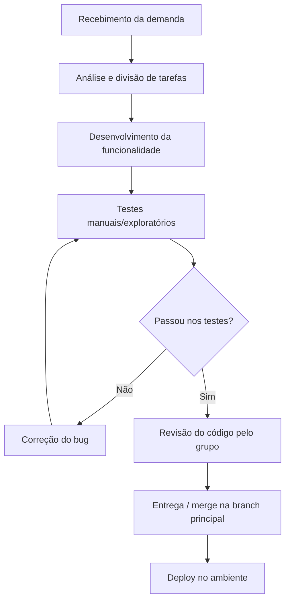

# PBL 9 — Qualidade de Processo

**Centro Universitário Senac-RS**
**Curso:** ADS / SPI · **Unidade Curricular:** Qualidade de Software · **Prof.:** Luciano Zanuz
**Sistema:** LocalEats — <https://local-eats-unisenac.vercel.app/>

---

## 📌 Contexto

Nos PBLs anteriores o foco esteve no **produto** — testar funcionalidades do LocalEats (busca, pedidos, avaliações, favoritos). A partir deste PBL o foco passa a ser o **processo** utilizado pela equipe para desenvolver e validar essas funcionalidades.

## 1. Mapeamento do Processo Atual

Fluxo utilizado pela equipe para desenvolver e validar funcionalidades do LocalEats, do recebimento da demanda até a entrega:

**Descrição das etapas:**

1. **Recebimento da demanda** — o grupo recebe a atividade do PBL (ex.: implementar/testar uma funcionalidade do LocalEats).
2. **Análise e divisão de tarefas** — o grupo discute o escopo e distribui responsabilidades entre os integrantes.
3. **Desenvolvimento** — a funcionalidade ou o teste é implementado.
4. **Testes** — execução manual/exploratória (e, quando aplicável, automatizada) para validar o que foi desenvolvido.
5. **Correções** — bugs identificados nos testes retornam para o desenvolvimento antes de seguir no fluxo.
6. **Entrega** — o código é revisado, versionado no GitHub e considerado concluído.

## 2. Identificação de Entradas, Atividades e Saídas

| Etapa | Entrada | Atividade | Saída |
|---|---|---|---|
| Recebimento da demanda | Enunciado do PBL / requisito da funcionalidade | Leitura e interpretação do enunciado | Entendimento compartilhado da tarefa |
| Análise e divisão de tarefas | Entendimento da tarefa | Definição de quem faz o quê | Tarefas atribuídas aos integrantes |
| Desenvolvimento | Tarefa atribuída | Implementação da funcionalidade/teste | Código-fonte desenvolvido |
| Testes | Código desenvolvido | Execução de testes manuais/automatizados | Lista de bugs encontrados (ou aprovação) |
| Correções | Bug identificado | Ajuste no código | Código corrigido |
| Entrega | Código validado | Commit, push e atualização da documentação | Repositório atualizado no GitHub |

## 3. Reflexão sobre o Processo

**O processo utilizado pela equipe está claramente definido?**
Parcialmente. O fluxo geral (desenvolver → testar → corrigir → entregar) é seguido de forma implícita, mas não está documentado formalmente em nenhum lugar antes deste PBL — cada integrante segue por experiência do que já foi feito nas entregas anteriores.

**Todos os integrantes seguem o mesmo fluxo de trabalho?**
Em linhas gerais sim, mas de forma informal: não há um checklist ou ferramenta que garanta que todos passem pelas mesmas etapas (por exemplo, nem sempre há revisão cruzada do código antes do merge).

**Em quais etapas a qualidade é verificada?**
Principalmente na etapa de **testes**, de forma manual/exploratória, e ocasionalmente na **revisão de código**. Não há verificação automatizada de qualidade em todas as entregas — isso só passou a existir a partir dos PBLs de automação (PBL6 a PBL8).

**Quais melhorias poderiam tornar o processo mais eficiente?**
- Padronizar um checklist de "Definition of Done" para cada entrega;
- Automatizar a execução dos testes via CI (assunto do PBL12);
- Registrar bugs formalmente (ex.: GitHub Issues) em vez de combinar verbalmente;
- Fazer revisão de código (code review) obrigatória antes do merge.

**Como a qualidade do processo impacta a qualidade do produto final?**
Um processo mal definido tende a gerar retrabalho e defeitos recorrentes — como os bugs de persistência encontrados no PBL5 (favoritos e avaliações), que poderiam ter sido evitados com testes automatizados rodando a cada alteração. Quanto mais estruturado o processo (entradas, atividades e saídas claras, com verificação de qualidade em cada etapa), menor a chance de defeitos chegarem ao produto final.

---

## 📊 Conclusão

O processo atual da equipe é funcional, mas ainda **informal**: funciona por alinhamento verbal e prática repetida, não por um fluxo documentado e seguido à risca. Isso já se mostrou suficiente para entregar as atividades, mas é um ponto de risco — principalmente à medida que o projeto cresce e mais automação (CI, testes automatizados) passa a fazer parte da rotina, como será explorado nos próximos PBLs.
